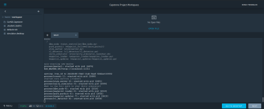
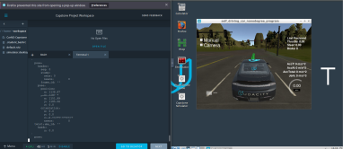
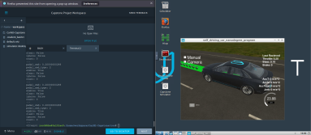
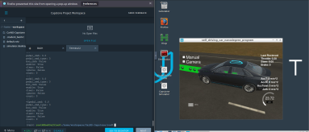
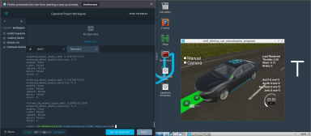
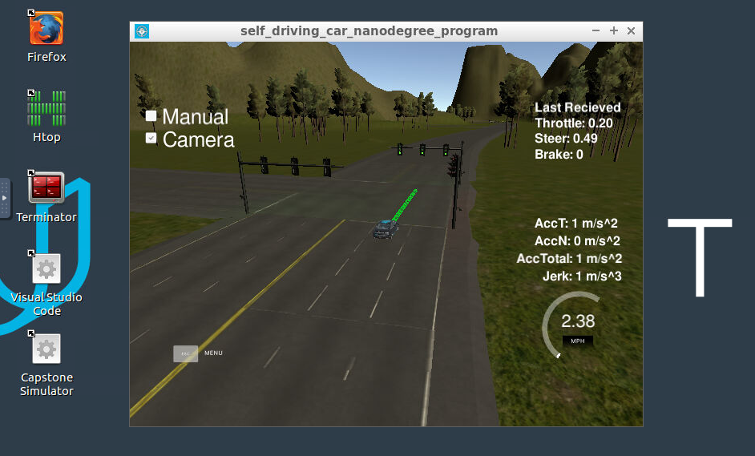
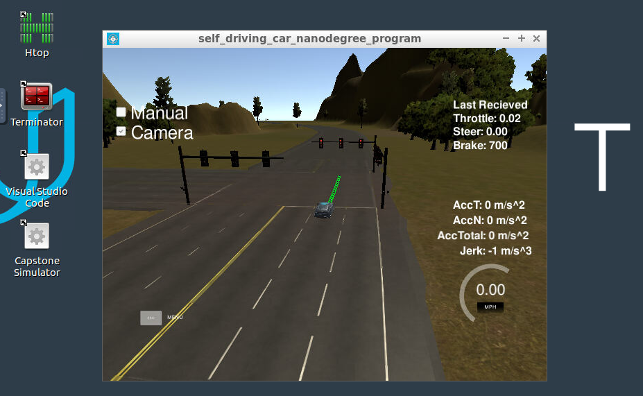
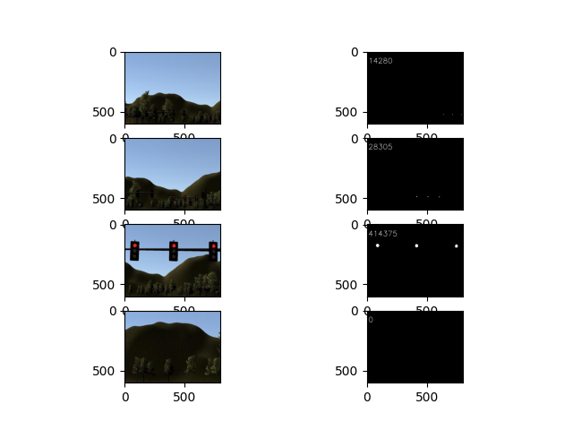
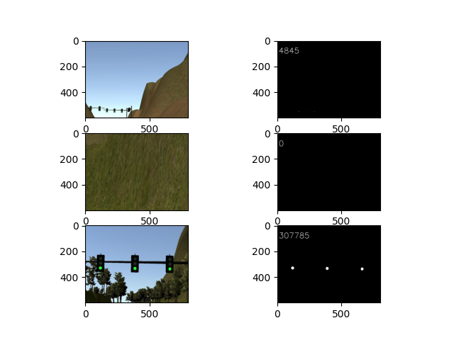
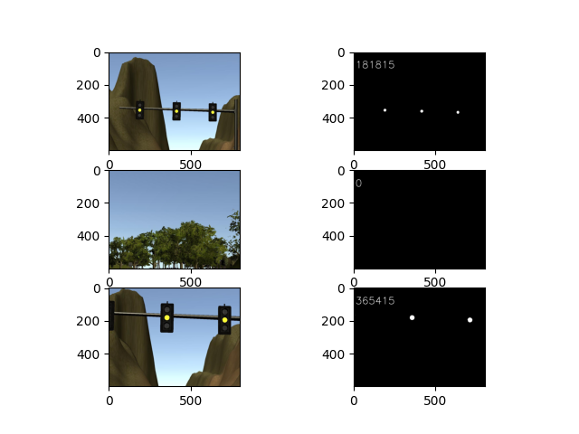

# Project: System integraion

Self-Driving Car Engineer Nanodegree Program [](http://www.udacity.com/drive)

### Project Specification

## Programming a Real Self-Driving Car

Project must meet the [rubrics from here](https://review.udacity.com/#!/rubrics/3058/view).


| |Criteria| Result |
|--------|--------|--------|
|**Running the Code** :ok: |The code is built successfully and connects to the simulator.| [](./images/R001.png) |
|**Control and Planning** :ok: |Waypoints are published to plan Carla’s route around the track.| [](./images/R002.png) |
|**Control and Planning** :ok: |Controller commands are published to operate Carla’s throttle, brake, and steering.| [](./images/R003_01.png) [](./images/R003_02.png) [](./images/R003_03.png) |
|**Successful Navigation** :ok: |Successfully navigate the full track more than once.|  |



## Solution description

### waypoint_updater

Waypoint updater consume current car position and produce look ahead waypoints with corresponded velocity parameter. ```generate_lane``` (lines 67-83) method perform this task.
* Normal case if no red traffic light detected it calls ```waypoints_norm``` (lines 135-143)
that generate next ```LOOKAHEAD_WPS``` waypoints. It's implemeneted in circular way to allow car drive more than one lap.
* if red traffic light is detected ```waypoints_slowdown``` (lines 146-158) method is called. It calculated corresponded reduction of velocity and set to waypoint.  

See: ```ros/src/waypoint_updater/waypoint_updater.py```

NOTE: ```ros/src/waypoint_loader/waypoint_loader.py``` line 57 need to be updated to allow car drive more then one lap.


### twist_controller

Twist controller consume ```/twist_cmd``` topic and produce appropriate throttle, brake, and steering commands. See ```ros/src/twist_controller/dbw_node.py``` lines 81-84
Also if ```/vehicle/dbw_enabled``` set to **False** it reset a controller and stop publish commands.
Main control method perform followings steps:
* calculate steering
* filter out velocity measurement noise
* calculate velocity error
* produce throttle value
* adjust brake value if needed.   

```ros/src/twist_controller/twist_controller.py``` lines 42-62

### tl_detector

Naive implementation based on openCV inRange API show surprisingly good results:

|  <font color="red">red</font> | <font color="green">green</font> | <font color="yellow">yellow</font> |
|------|-------|--------|
|  |  |  |

Another thing that according to project requirements only red traffic light need to be detected.  

According to this and considering that VM resources are to low I decide use this naive implementation in project that drive with simulator, see: ``` ros/src/tl_detector/light_classification/tl_classifier.py ``` lines 17-18

Corresponded traffic light waypoint detected according to algorithm that decribed in lesson 4 Waypoint updater node, see: ``` ros/src/tl_detector/tl_detector.py ``` lines 163-176
